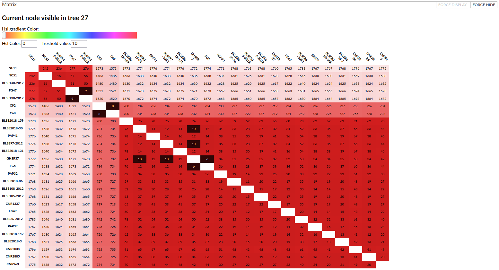

# Markdown

## Custom build for auspice
Base [Auspice](https://github.com/nextstrain/auspice)  version 2.27.0

### Features

New panels to display a distance matrix that dynamically update with the tree view.
<p align="left"></p>

## Installation

Install [Auspice](https://github.com/nextstrain/auspice) from source, and replace with the custom build.
```bash
git clone https://github.com/nextstrain/auspice.git
git clone https://github.com/Iry63/custom_auspice_build.git
cd auspice
mv src src_old
cp -r ../custom_auspice_build/src src
npm install --global .
```


Generate auspice build:  
```bash
auspice build
```
Launch auspice:  
```bash
auspice view --datasetDir path/to/data/
```

And view auspice in the browser at [localhost:4000](http://localhost:4000). To be sure the custom build is installed in the web page you shoud see 'custom build by Iry' next the logo. If this is not your case see below in 'Install Error' section.


## How to add matrix

**Recommended:**
To add your matrix you will need a .tsv file that contain the matrice and use [Auract](https://github.com/Iry63/Auract) a tool that i have made to generate auspice and microreact input from tree and metadata. The auspice module of Auract will also add the matrix in the .json file if you give a .tsv file that contain the distance matrix.


**If don't want to use Auract (not  recommended):**
The matrix might have some display error if using the following methode.
An other way is to get your matrice in html table and add at the end of the json file your html code. Don't forgot to sort the tsv or table with the tree order for better readability.


```json
"matrice": "<table></table>"
```
The templates needed is the following :
```html
<table>
	<thead><tr><th>{h1}</th><th>{h2}</th><th>{h3}</th></tr></thead>
	<tbody>
		<tr><th>{f1}</th><td>{f2}</td><td>{f3}</td></tr>
	</tbody>
</table>
```
Here a [link](https://www.convertcsv.com/csv-to-html.htm) that could help you get your html table from tsv/csv.
If you are familiar with python and pandas module you can use this function [Styler.render()](https://pandas.pydata.org/pandas-docs/stable/reference/api/pandas.io.formats.style.Styler.render.html) to get html table from dataframe. This is what [Auract](https://github.com/Iry63/Auract) use .

## Install Error
#### npm error
If you can't run 'auspice view' command that mean you got an npm error. If this is your case, first uninstall auspice to be sure by running following command.
```bash
npm uninstall -g auspice
npm uninstall auspice
```
Then make sure you are in the auspice folder, and also be sure you have the permission to run the command maybe use sudo. And redo the installation process.

#### can't see custom build
If you can't see 'custom build by Iry' next the logo but auspice view command work. That mean the src folder have not been changed make sure you have cloned this repository then take the src folder in it and replace it with src folder in auspice folder. Then rerun 'auspice build' command.

```bash
auspice build
```

[](https://www.gnu.org/licenses/gpl-3.0.en.html)

